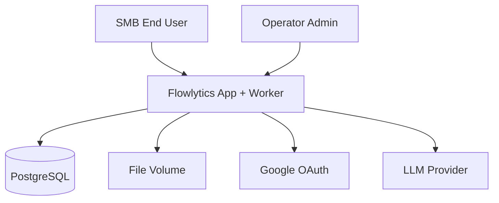

# System Context

## Trust boundaries

1. Browser → App: untrusted input; session auth required for private APIs.
2. App → LLM: only for opt-in AI blocks; redact where practical; debit wallet first.
3. Admin routes: separate authorisation; no default access to file bytes of users in ops views.
4. Worker → DB/Files: trusted internal process; no public exposure.
